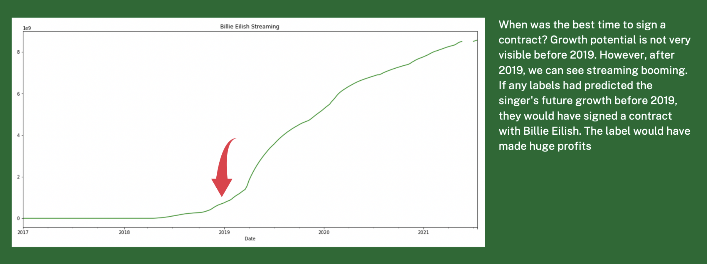
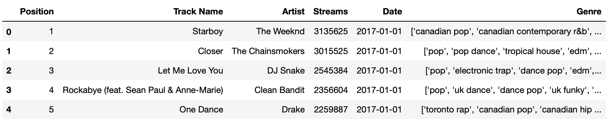
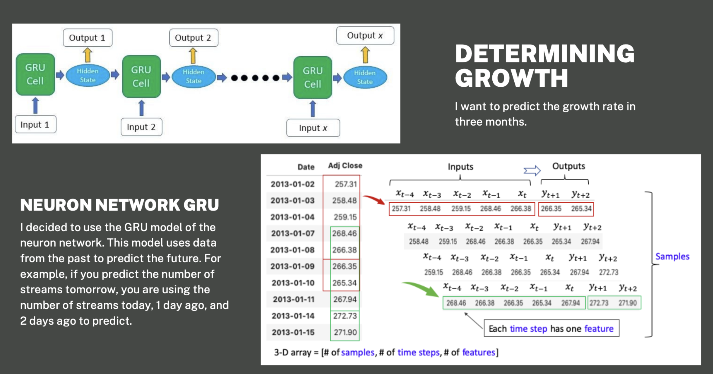
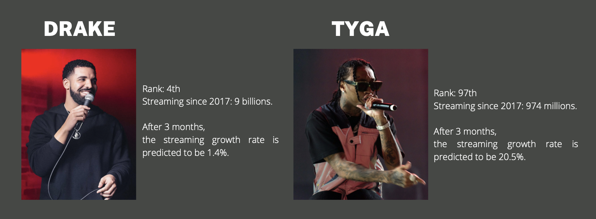
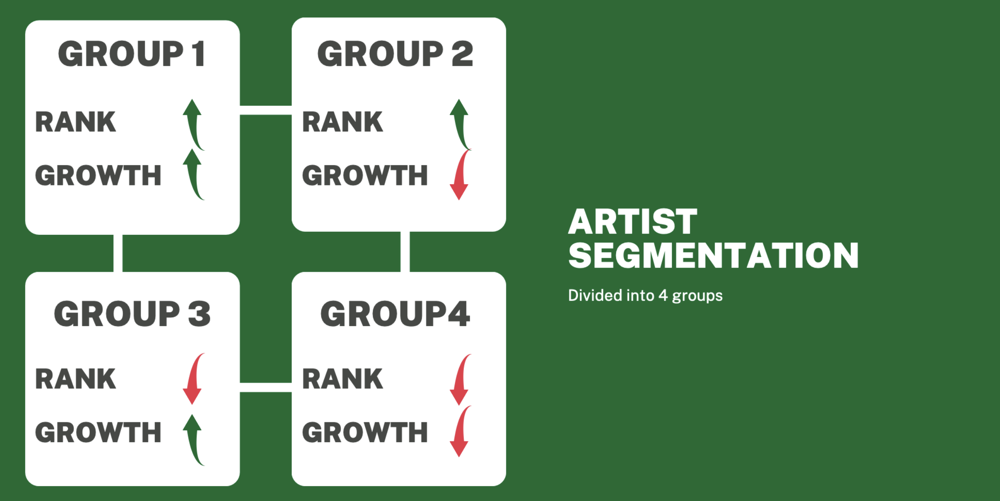
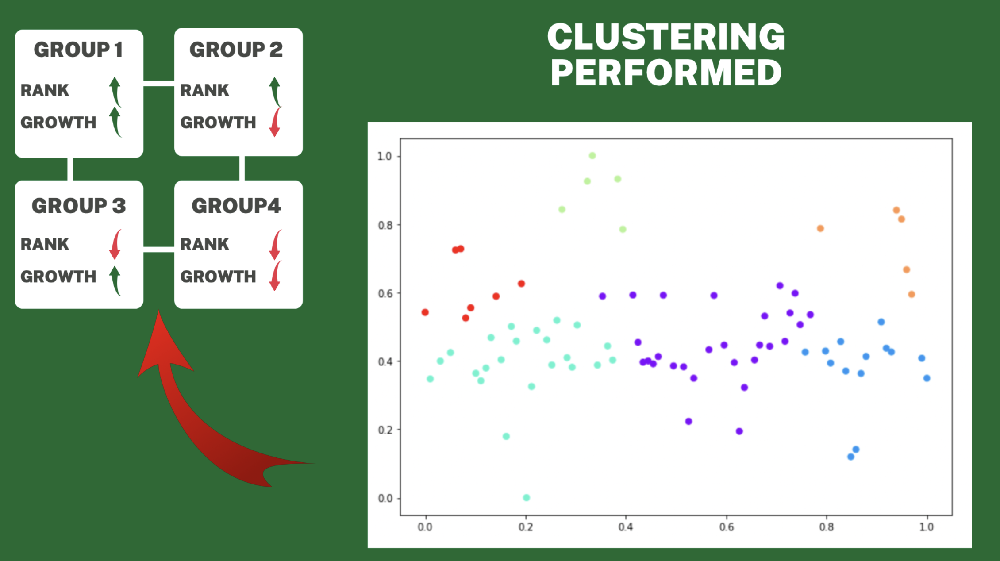
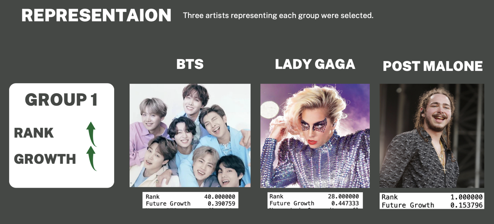
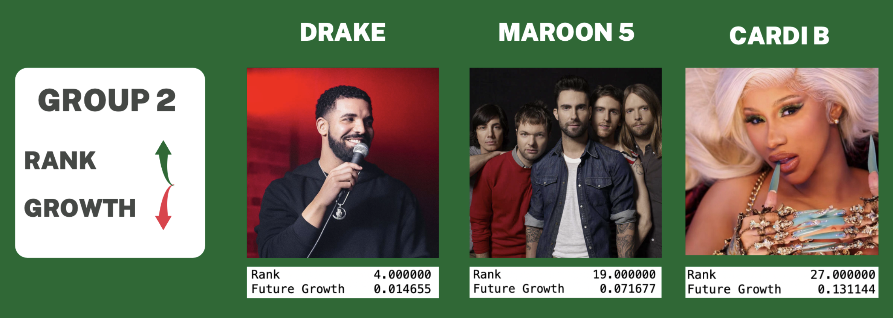
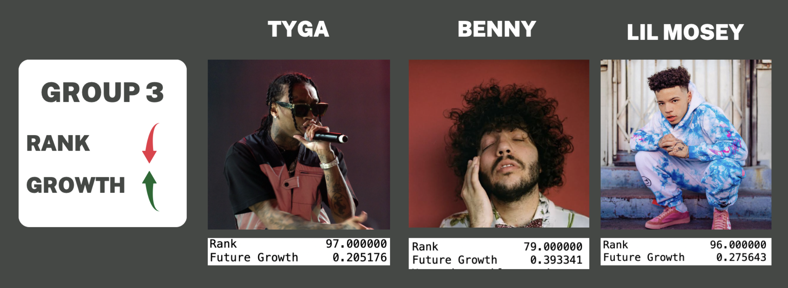
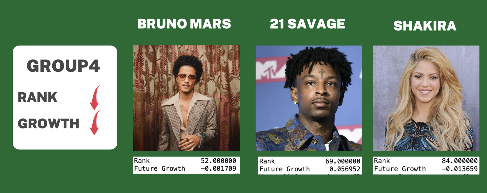

# Artists Analysis

There are many record labels in the world today, and there are good artists. Record labels are always looking for artists they want to work with. What kind of artists will make them money?

### What is the main points?
They can expect high profits by increasing sales and reducing costs. There are two things I want to say.They are cost and growth potential. Will higher costs lead to higher sales? Will artists grow further after signing with a label? Artists with too high rank require a lot of costs. If their growth potential is still high, I might recommend them. However, there is no guarantee that they will be able to maintain a high rank forever. If they are artists with high growth potential, even if their current ranks are not high, I think it is worth investing in.

### Billie Eilish Streaming Graph (Example)

### What I proceeded
I predicted growth potential for each artists. Also, determined their rank. I did artists segmentation with rank and predicted potential.

### Data

I got the Top 200 Streaming Chart from Spotify. This data includes charts from 2017 to 2021.

##### Data Summary
* This dataset contains 1,128 artists.
* Each song is averaging 1.1 millions streams per day.
* The most streamed singer is Post Malone, at 13.5 billions streaming.
* The least-streamed singer is M.I.A. at 341 thousand streaming.
**I built a predictive model of the 100 most streamed singers here.**

### Modeling

### Tyga vs Drake
Comparing these two artists, Drake ranks high, but his growth rate is not high.
Tyga has a lower rank, but has a high growth rate.

### Segmentation
I proceeded with Artist Segmentation.
Divided into 4 groups based on predicted growth rate and rank.
* High rank and high growth rate are group 1
* High rank and low growth rate are group 2
* Low rank and high growth rate are group 3
* Low rank and low growth rate are group 4

### Clustering

### Representation

### Conclusion 
Among them, I can recommend the artists of Group 1 and Group 3.
All of them are projected to have high growth rates.
* If you want a record label to make a stable profit, i recommend Group 1 artists.
* If the record label is targeting for big profits, i recommend group 3 artists.